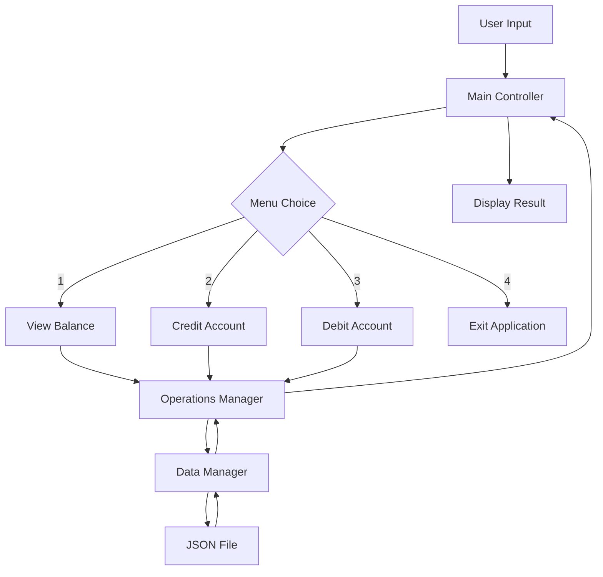

# High-Level Design Document
## Node.js Account Management System

### Document Information
- **Project**: Account Management System (Node.js)
- **Date**: June 11, 2025
- **Version**: 1.0
- **Author**: System Design
- **Status**: Active Development

---

## 1. Executive Summary

This document outlines the high-level design for a Node.js-based Account Management System that was converted from a legacy COBOL application. The system provides basic banking operations including balance inquiry, credit transactions, and debit transactions through a command-line interface.

### 1.1 Project Overview
The Account Management System is a modernized version of a COBOL accounting application, reimplemented in Node.js to provide:
- Interactive CLI-based account management
- Persistent balance storage using JSON
- Transaction validation and error handling
- Modular architecture for maintainability

---

## 2. System Architecture

### 2.1 Architecture Pattern
The system follows a **Modular Layered Architecture** with clear separation of concerns:

```
┌─────────────────────────────────────┐
│           Presentation Layer        │
│              (main.js)              │
│         CLI Interface & Menu        │
└─────────────────────────────────────┘
                    │
┌─────────────────────────────────────┐
│          Business Logic Layer       │
│            (operations.js)          │
│    Transaction Processing & Logic   │
└─────────────────────────────────────┘
                    │
┌─────────────────────────────────────┐
│           Data Access Layer         │
│              (data.js)              │
│      File I/O & Data Persistence    │
└─────────────────────────────────────┘
                    │
┌─────────────────────────────────────┐
│           Storage Layer             │
│            (balance.json)           │
│        Persistent Data Storage      │
└─────────────────────────────────────┘
```

### 2.2 Component Architecture

#### 2.2.1 Core Components

| Component | File | Responsibility | Dependencies |
|-----------|------|----------------|--------------|
| **Main Controller** | `main.js` | User interface, menu system, application flow control | `operations.js`, `readline` |
| **Operations Manager** | `operations.js` | Business logic, transaction processing, validation | `data.js`, `readline` |
| **Data Manager** | `data.js` | Data persistence, file I/O operations | `fs`, `path` |
| **Data Store** | `balance.json` | Persistent storage for account balance | None |

#### 2.2.2 Legacy Components (COBOL)
The original COBOL implementation consists of:
- `main.cob` - Main program loop (converted to `main.js`)
- `operations.cob` - Transaction operations (converted to `operations.js`)
- `data.cob` - Data handling (converted to `data.js`)

---

## 3. System Design

### 3.1 Data Flow Architecture



### 3.2 Module Interactions

#### 3.2.1 Main Application Flow
1. **Initialization**: Application starts with `main.js`
2. **Menu Display**: Present user with operation options
3. **Input Handling**: Capture and validate user choice
4. **Operation Delegation**: Forward request to appropriate operation
5. **Data Processing**: Execute business logic and data operations
6. **Result Display**: Present outcome to user
7. **Loop Continuation**: Return to menu or exit

#### 3.2.2 Transaction Processing Flow
1. **Input Validation**: Verify transaction amount format and constraints
2. **Balance Retrieval**: Read current account balance
3. **Business Rule Application**: Apply credit/debit logic and validation
4. **Balance Update**: Write updated balance to storage
5. **Confirmation**: Display transaction result

---

## 4. Technical Specifications

### 4.1 Technology Stack

| Layer | Technology | Version | Purpose |
|-------|------------|---------|---------|
| **Runtime** | Node.js | v18+ | JavaScript runtime environment |
| **Core Libraries** | `readline` | Built-in | User input handling |
| **File System** | `fs` | Built-in | File operations |
| **Path Utilities** | `path` | Built-in | File path management |
| **Data Format** | JSON | Standard | Data serialization |

### 4.2 System Requirements

#### 4.2.1 Runtime Requirements
- Node.js v18.0 or higher
- Linux/Unix-compatible operating system
- Read/write access to application directory

#### 4.2.2 Performance Specifications
- **Startup Time**: < 100ms
- **Transaction Processing**: < 50ms per operation
- **Memory Usage**: < 50MB under normal operation
- **File Size**: Balance file < 1KB

### 4.3 Data Specifications

#### 4.3.1 Balance Data Structure
```json
{
  "balance": 1000.00
}
```

#### 4.3.2 Data Constraints
- **Balance Range**: 0.00 to 999999.99
- **Precision**: 2 decimal places
- **Format**: Floating-point number
- **Default Value**: 1000.00

---

## 5. Interface Design

### 5.1 Command Line Interface

#### 5.1.1 Main Menu
```
--------------------------------
Account Management System
1. View Balance
2. Credit Account
3. Debit Account
4. Exit
--------------------------------
Enter your choice (1-4):
```

#### 5.1.2 Transaction Interfaces

**Balance Inquiry**
```
Current balance: 1000.00
```

**Credit Transaction**
```
Enter credit amount: [user input]
Amount credited. New balance: [calculated balance]
```

**Debit Transaction**
```
Enter debit amount: [user input]
Amount debited. New balance: [calculated balance]
```

**Error Handling**
```
Invalid amount.
Insufficient funds for this debit.
Invalid choice, please select 1-4.
```

### 5.2 User Experience Flow

1. **Application Start**: Display main menu
2. **Option Selection**: User inputs choice (1-4)
3. **Transaction Processing**: System processes request
4. **Result Display**: Show outcome or error message
5. **Menu Return**: Automatically return to main menu (except exit)
6. **Graceful Exit**: Display goodbye message on exit

---

## 6. Security Considerations

### 6.1 Input Validation
- **Numeric Validation**: Ensure transaction amounts are valid numbers
- **Range Validation**: Verify amounts are positive and within limits
- **Menu Validation**: Restrict input to valid menu options (1-4)

### 6.2 Data Protection
- **File Permissions**: Ensure balance.json has appropriate read/write permissions
- **Error Handling**: Prevent application crashes from invalid data
- **Data Integrity**: Validate JSON structure before processing

### 6.3 Operational Security
- **Local Storage**: Data stored locally, no network transmission
- **Single User**: Designed for single-user operation
- **No Authentication**: Basic system without user authentication

---

## 7. Error Handling Strategy

### 7.1 Error Categories

| Error Type | Handling Strategy | User Impact |
|------------|------------------|-------------|
| **Invalid Input** | Validation + User Message | Prompt for correct input |
| **Insufficient Funds** | Business Rule + Warning | Transaction rejected |
| **File I/O Error** | Graceful fallback + Error message | System continues with defaults |
| **JSON Parse Error** | Error recovery + Initialization | Reset to default balance |

### 7.2 Recovery Mechanisms
- **Missing Files**: Automatic creation with default values
- **Corrupted Data**: Reset to default state (1000.00 balance)
- **Invalid Transactions**: Reject with explanatory message
- **System Errors**: Graceful degradation with user notification

---

## 8. Performance Considerations

### 8.1 Optimization Strategies
- **Synchronous I/O**: Use for simplicity in CLI application
- **Memory Management**: Minimal memory footprint with event-driven architecture
- **Response Time**: Immediate feedback for all user interactions

### 8.2 Scalability Considerations
- **Single User**: Designed for individual account management
- **File-Based Storage**: Suitable for low-volume transactions
- **Future Enhancement**: Ready for database integration if needed

---

## 9. Maintenance and Extensibility

### 9.1 Code Organization
- **Modular Design**: Clear separation of concerns
- **Function-Based**: Easy to test and modify individual operations
- **Standard Patterns**: Follows Node.js best practices

### 9.2 Extension Points
- **New Operations**: Add functions to `operations.js`
- **Enhanced Storage**: Replace file-based storage with database
- **Web Interface**: Add Express.js for web-based interface
- **Multi-Account**: Extend data model for multiple accounts

### 9.3 Testing Strategy
- **Unit Tests**: Test individual functions in isolation
- **Integration Tests**: Test component interactions
- **User Acceptance Tests**: Validate complete user workflows

---

## 10. Deployment and Operations

### 10.1 Deployment Process
1. **Environment Setup**: Install Node.js v18+
2. **File Deployment**: Copy application files to target directory
3. **Permission Setup**: Ensure read/write access to application directory
4. **Initial Run**: Execute `node main.js` to start application

### 10.2 Operational Procedures

#### 10.2.1 Starting the Application
```bash
cd /path/to/application
node main.js
```

#### 10.2.2 Backup Procedures
```bash
# Backup balance data
cp balance.json balance.json.backup.$(date +%Y%m%d)
```

#### 10.2.3 Recovery Procedures
```bash
# Restore from backup
cp balance.json.backup.YYYYMMDD balance.json
```

---

## 11. Future Enhancements

### 11.1 Planned Features
- **Transaction History**: Log all transactions with timestamps
- **Multiple Accounts**: Support for multiple user accounts
- **Data Validation**: Enhanced input validation and error checking
- **Configuration**: External configuration file for settings

### 11.2 Technical Improvements
- **Database Integration**: Replace JSON with SQLite or PostgreSQL
- **Web Interface**: Add REST API and web frontend
- **Authentication**: Add user login and security features
- **Logging**: Implement comprehensive application logging

### 11.3 Migration Considerations
- **Data Migration**: Scripts to migrate from JSON to database
- **Backward Compatibility**: Maintain CLI interface alongside new features
- **Performance Monitoring**: Add metrics and monitoring capabilities

---

## 12. Conclusion

The Node.js Account Management System successfully modernizes the legacy COBOL application while maintaining functional compatibility. The modular architecture provides a solid foundation for future enhancements while keeping the current implementation simple and maintainable.

### 12.1 Key Achievements
- ✅ **Functional Parity**: All COBOL features successfully converted
- ✅ **Modern Technology**: Leverages Node.js ecosystem
- ✅ **Maintainable Code**: Clean, modular architecture
- ✅ **User Experience**: Intuitive CLI interface

### 12.2 Success Metrics
- **Code Quality**: Well-structured, commented, and documented
- **Performance**: Fast response times and minimal resource usage
- **Reliability**: Robust error handling and recovery mechanisms
- **Extensibility**: Ready for future feature additions

---

## Appendices

### Appendix A: File Structure
```
cobol-accounting-system/
├── main.js              # Main application controller
├── operations.js        # Business logic operations
├── data.js             # Data access layer
├── balance.json        # Persistent data storage
├── main.cob           # Original COBOL main program
├── operations.cob     # Original COBOL operations
├── data.cob           # Original COBOL data handling
└── [compiled files]   # COBOL compilation artifacts
```

### Appendix B: API Reference

#### Main Module (`main.js`)
- `main()`: Application entry point
- `mainMenu()`: Display menu interface
- `loop()`: Main application loop

#### Operations Module (`operations.js`)
- `showTotal()`: Display current balance
- `creditAccount(callback)`: Process credit transaction
- `debitAccount(callback)`: Process debit transaction

#### Data Module (`data.js`)
- `readBalance()`: Retrieve current balance from storage
- `writeBalance(balance)`: Save balance to storage

### Appendix C: Configuration
- **Default Balance**: 1000.00
- **Balance File**: `balance.json`
- **Input Timeout**: None (waits for user input)
- **Decimal Precision**: 2 places

---

*End of Document*
